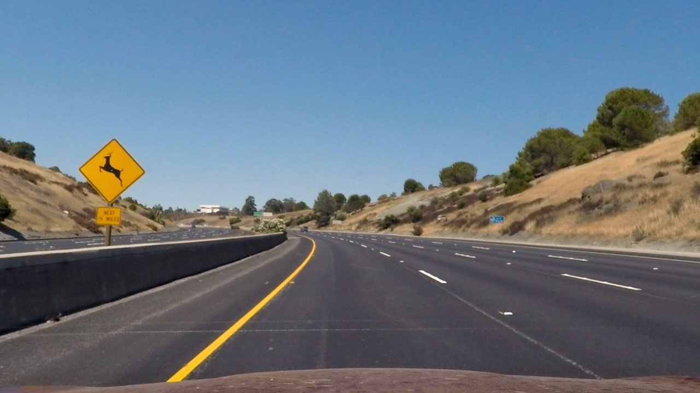

# Advanced-Lane-Finding
> Please refer to: Self-Driving Car Engineer Nanodegree - Udacity, [Term 1 - Project 4](https://github.com/udacity/CarND-Advanced-Lane-Lines)

### Overview
This project aims to to identify the lane boundaries in a video. 

The code is stored in a [Jupyter Notebook](http://jupyter.org/) and requires **Python 3.5**. Please refer to the [project website](https://github.com/udacity/CarND-Behavioral-Cloning-P3) for implementation details. 

This [video](https://vimeo.com/207707140) contains the outcome of this project together with the results of the _Vehicle Detection-and-Tracking_ project). 

## The Advanced Lane Finding Project

The goals / steps of this project are the following:

* Compute the camera calibration matrix and distortion coefficients given a set of chessboard images.
* Apply a distortion correction to raw images.
* Use color transforms, gradients, etc., to create a thresholded binary image.
* Apply a perspective transform to rectify binary image ("birds-eye view").
* Detect lane pixels and fit to find the lane boundary.
* Determine the curvature of the lane and vehicle position with respect to center.
* Warp the detected lane boundaries back onto the original image.
* Output visual display of the lane boundaries and numerical estimation of lane curvature and vehicle position.

Here I will consider the [rubric points](https://review.udacity.com/#!/rubrics/571/view) individually and describe how I addressed each point in my implementation.  

---
### Camera Calibration

>#1. _Briefly state how you computed the camera matrix and distortion coefficients. Provide an example of a distortion corrected calibration image._  

The code for this step is contained in the cells in the **Paragraph 1** of the IPython notebook located in "./example.ipynb".    

I start by preparing "object points", which will be the (x, y, z) coordinates of the chessboard corners in the world. Here I am assuming the chessboard is fixed on the (x, y) plane at z=0, such that the object points are the same for each calibration image.    
Thus, `objp` is just a replicated array of coordinates, and `objpoints` will be appended with a copy of it every time I successfully detect all chessboard corners in a test image.  

When possible, `imgpoints` will be appended with the (x, y) pixel position of each of the corners in the image plane with each successful chessboard detection. If the image does not contain the rigth number and position of the corners, a warning message is issued (this happens to me for three pictures).

The `cv2.calibrateCamera()` function gives the distortion coefficients that I applied to the both chessboard and test images using the `cv2.undistort()` function.  For the chessboard, I obtain this result: 

I then used the output `objpoints` and `imgpoints` to compute the camera calibration for all images analysed in the rest of the project, assuming that the same (or a very similar) camera that took the chessboard picures was later mounted on the car. 

---
### Pipeline (test images)

>#1. _Provide an example of a distortion-corrected image._

To demonstrate this step, I will describe how I apply the distortion correction to one of the test images like this one:

In the **Paragraph 2** I create the `calibrate_img()` function that reuse the distortion coefficients (`objpoints` and `imgpoints`) given by `cv2.calibrateCamera()` to calibrate the test images. 

>#2. _Describe how (and identify where in your code) you used color transforms, gradients or other methods to create a thresholded binary image.  Provide an example of a binary image result._

In the **Paragraph 3** I use a combination of color and gradient thresholds to generate a binary image. First, I find Sobel's directional gradients, magnitude gradient, directional threshold (via arctan2 numpy function), and - to fix any big yellow line - the S channel from the HLS image. Then, I combine logical and/or functions to select a binary image. 

The following is an example of the result of these function applied to a test image.

I code two function to do this task: they are in the subparagraph _Functions for image transformation_, even if, actually, they do the same thing. The first function is for studying how to reach an adequate tranform: it gives results as well a set of images to inspect and refining parameters; the second function is more essential and will be used for a fast running on video. 

>#3. _Describe how (and identify where in your code) you performed a perspective transform and provide an example of a transformed image._

The code for my perspective transform includes a function called `get_warped_images()` that appears in **Paragraph 4** at the subparagraph named _Apply a perspective transform_ [cell 15].

The `get_warped_images()` function takes as inputs an undistorted color image, its binary version, as well as source (`src`) and destination (`dst`) points. 

In order to find the source and destination points I apply the following step to reach a good estimate of the relative dimensions of the destination rectangle: 

* Find an approximate strigth lane in front of the car - (re-using Project 1 code)
* Use the extreme points of the two lines as source (`src`) points
* Estimate the distance (`len_line`) in meters from the camera to the more distant point of the line(s), using as benchmark the dotted lines on the road in the picture(s)  (on the highways, they are usually 10 feet long and separated by a 30 feet space) 
* To set the destination (`dst`) points, consider the `3.7 m` width of a lane. 
* Now you have the approximate proportion (`len_line` & `3.7 m`) of the destination rectangle sides on the road-plane - as seen by a bird flying on. 

This resulted in the following source and destination points:

| Source        | Destination   | 
|:-------------:|:-------------:| 
|  494, 720     | 290, 720      | 
|  570, 472     | 290,   0      |
|  705, 472     | 990,   0      |
| 1146, 460     | 960, 720      |

I verified that my perspective transform was working as expected by drawing the `src` and `dst` points onto a test image and its warped counterpart to verify that the lines appear parallel enough in most of the warped image.

>#4. _Describe how (and identify where in your code) you identified lane-line pixels and fit their positions with a polynomial?_

I follow yhe process described in the course lessons. Once fitted my lane lines with a 2nd order polynomial I get images like this:

In the **Paragraph 5** (subparagraph _Functions for finding (curved) line boundaries_) [cell 17] there are two function to perform this task: the first one is rich in options and graphs and I use it to test the code on single images; the second one is more essential and tailored for a faster run on videoclips. Both take a `binary_warped` image as input.

The code to see results on a single image is the subparagraph _Finding curves boundaries on test image_ [cell 18]

>#5. _Describe how (and identify where in your code) you calculated the radius of curvature of the lane and the position of the vehicle with respect to center._  

I do this in **Paragraph 6** coding functions `away_from_center` and `curvature` [cell 19].

Usually, the two lines are not equally marked on the road, and the histogram shows a different height for left and right lines. 
Once found the radius of each curve line (left and rigth) I calculate a weighted average of the two radius using `left_weight` and `right_weight` values - taken from the `histogram` used for finding curves in Paragraph 5.

To infer the position in the lane, I use the estimated values of the curves at the car lavel (bottom of the picture), calculate the middle point end its distance (in pixels) form the center of the mddle point of the (horizontal) side of the picture. I then apply the horizontal-conversion factor (from pixels to meters).

>#6. _Provide an example image of your result plotted back down onto the road such that the lane area is identified clearly._

I implemented this step in **Paragraph 7** with the `back_warp_image()` function. Here is an example of my result on a test image:

---
### Pipeline (video)

>#1. _Provide a link to your final video output.  Your pipeline should perform reasonably well on the entire project video (wobbly lines are ok but no catastrophic failures that would cause the car to drive off the road!)._

Please refer to the video in `my_project_video_x.mp4`.

--

### Discussion

>#1. Briefly discuss any problems / issues you faced in your implementation of this project.  Where will your pipeline likely fail?  What could you do to make it more robust?

Advanced line finding is quite complex and there are a lot of micro-issues to solve.

Few passages are non completely clear yet, at least to me. 
Is the polynomial with degree two accurate anough, how to get satisfied in finding parallel lines, can you simply averaging the polynomial coefficient, can you derive meters conversion from pixels via maths without simulating points, how long should be the memory of our Line class instances, how to clear the shadow of the trees (on the lane), can you forecast missing lines with neural networks ... ?

There is no unique answer to all these questions, and the "can I do better?" approach is still pending on my results. 

 

